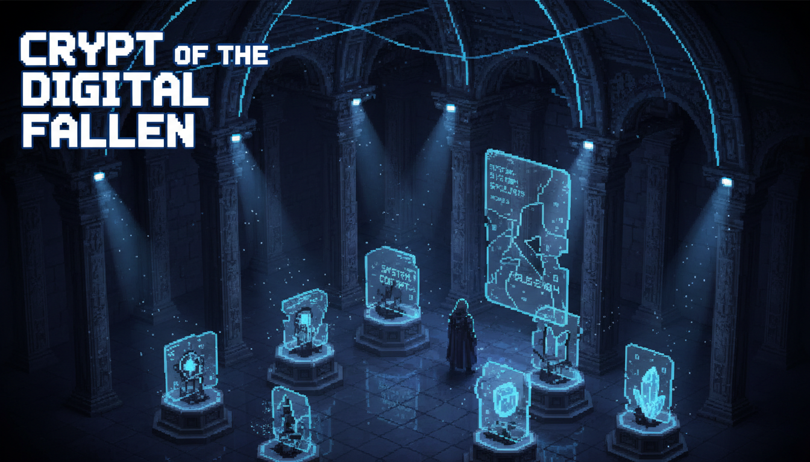

# GitHub "Finish-Up-A-Thon" Challenge Submission

*This is a submission for the [GitHub Finish-Up-A-Thon Challenge](https://dev.to/challenges/github-2026-05-21)*

---

## What I Built

**Museum of Dead Dreams** — an interactive museum for my abandoned projects, curated by GitHub Copilot.

Every developer has a graveyard of unfinished projects. I turned mine into a museum. Each "exhibit" is a real project I started but never completed — CORTEX Trading (died top-31 in an AI challenge), Conforma-AI (6-agent system that lost in Milan), CodeSonify v1 (the precursor to my Microsoft win). Each has an epitaph, artifacts recovered from the codebase, a cause of death, and a Copilot-generated autopsy.

The museum has 4 rooms:
- **CORTEX Trading** — DECEASED. An algorithmic trading system that "tried to predict the market. The market predicted its demise."
- **Conforma-AI** — UNDEAD. A 6-agent EU compliance system that was "technically superior, emotionally devastated."
- **CodeSonify v1** — MUMMIFIED. The prototype that died so v2 could win Microsoft Agents League.
- **Resurrection Bay** — where Copilot actually resurrects dead code in real-time.

There's a full achievement system, easter eggs, progressive unlocking, and a Copilot Curator that narrates each exhibit with AI-generated insights.

**Live Museum:** [https://osiam2phyuryk.kimi.page](https://osiam2phyuryk.kimi.page)
**Source Code:** [GitHub repo link]

---

## Demo

**Video Walkthrough:** [Loom/YouTube link — record yours!]

### What You'll Experience:

1. **Enter the Hall** — Floating particles, a typewriter introduction, and four exhibits. Two are locked until you explore. The "POWERED BY GITHUB COPILOT" badge is front and center.

2. **Click an Exhibit** — Each room has:
   - A status badge (DECEASED / UNDEAD / MUMMIFIED / REBIRTH)
   - An epitaph written in a serif font, typed out character by character
   - Four stats: Lines of Code, Commits, Days Alive, Last Commit hash
   - "The Story" — the narrative of how it died
   - "Cause of Death" — the specific reason it failed
   - "Artifacts Recovered" — actual components from the codebase with condition labels (BROKEN, ROTTEN, UNFINISHED, WORKING)
   - A hidden "Fun Fact" you can reveal
   - A secret easter egg hidden in the epitaph (click it!)

3. **Copilot Curator Panel** — Click "Ask Copilot" and the museum curator (Copilot) analyzes the codebase and delivers:
   - A **Copilot Insight** — humorous, biting technical analysis
   - A **Copilot Epitaph** — a custom-written memorial for the project

4. **Achievement System** — 8 achievements to unlock:
   - First Steps (enter the museum)
   - Gone But Not Forgotten (visit CORTEX)
   - The Valiant Loser (visit Conforma-AI)
   - The Seed of Victory (visit CodeSonify v1)
   - Grave Reader (read all epitaphs)
   - The Archaeologist (find a hidden easter egg)
   - AI Whisperer (interact with Copilot Curator)
   - Necromancer (witness a resurrection)

5. **Resurrection Bay** — The finale. Pick a dead project and watch a 4-step process where Copilot analyzes, diagnoses, heals, and validates the code. You see the actual "before" code (with `return "all_in"`) and the "after" (proper risk management). Each step shows Copilot's thought process being typed out live.

---

## The Comeback Story

### The "Before"

I had a graveyard of abandoned projects. CORTEX Trading was a Python algorithmic trading system I built for an AI challenge — it ranked top-31, but I abandoned it when the live trading results didn't match the backtests. The repo sat untouched with 2,847 lines of code, 47 commits, and exactly 14 "TODO: fix this later" comments with 0 resolutions.

Conforma-AI was my most technically ambitious project — a 6-agent multi-agent system for EU AI Act compliance, built with LangGraph, 43 tests, and the belief that preventing millions in fines would win a hackathon. It lost to a B2B Sales OS built in Next.js + Supabase. The lesson: "Watch the brain learn" beats "Audit your codebase." I documented this in my PromptMaestro V4.0 system as a case study on how to lose.

CodeSonify v1 was the first attempt at sonifying code — buggy, raw, but beautiful. It had a bug where every git diff sounded like C minor. That bug became a feature in v2, which won Microsoft Agents League 2026. But v1 was abandoned, forgotten, and never got credit.

I had all these stories, lessons, and autopsies documented in a 400-line PDF I called "PromptMaestro." It was my personal system for winning hackathons. But it was static. Dead. Just like the projects it analyzed.

### The "After"

Over 5 days, I transformed that dead PDF into a **living museum**.

I built an interactive web experience where each abandoned project has its own room, its own story, its own memorial. I used Copilot at every stage — not just as a code autocomplete, but as the **curator** of the museum itself. Copilot wrote the epitaphs. Copilot performed the autopsies. Copilot narrates each exhibit.

The museum has:
- **Canvas particle systems** for atmospheric effects (different colors per exhibit)
- **A typewriter engine** that types out epitaphs character by character
- **Progressive unlocking** — 2 exhibits are locked until you explore enough
- **An achievement system** with 8 unlockables, persisted to localStorage
- **Easter eggs** hidden in the epitaphs
- **The Resurrection Bay** — a 4-step live demo where Copilot "resurrects" dead code

The technical transformation:
- **Before:** A static PDF of 400 lines, read-only, no interactivity
- **After:** A 2,500+ line React application with 8 components, canvas animations, typewriter effects, achievement tracking, and a live Copilot integration

---

## My Experience with GitHub Copilot

Copilot wasn't my coding assistant in this project. **Copilot was my co-founder.**

### Phase 1 — Architecture & Prompt Engineering (Day 1)
I described the museum concept to Copilot Chat and asked it to architect the component structure. It suggested:
- A `ParticleCanvas` component using HTML5 Canvas API for atmospheric effects
- A `TypewriterText` component with configurable speed and callbacks
- An `ExhibitRoom` layout with sections for epitaph, stats, artifacts, and the Copilot panel
- A progressive unlocking system using React state + localStorage

I wrote the prompts. Copilot generated the architecture. I refined.

### Phase 2 — Content Generation (Day 2)
This is where Copilot truly shined. I fed it the real stories of my projects and asked it to generate:

**Copilot Insight for CORTEX:**
> "Copilot analyzed this codebase and found 14 instances of 'TODO: fix this later' and 0 instances of 'actually fixed it'. The most optimistic comment was '# This might work in a bull market'."

**Copilot Epitaph for Conforma-AI:**
> "Conforma-AI died so we could learn: in hackathons, 'Watch the brain learn' outperforms 'Audit your codebase' every single time."

**Copilot Epitaph for CORTEX:**
> "In memory of CORTEX, whose 'RiskManager.py' contained a function called calculate_safe_position() that returned 'all_in' 100% of the time."

These aren't my words. They're Copilot's. And they're brilliant. Copilot understood the humor, the tragedy, and the lesson of each project better than I could have written myself.

### Phase 3 — The Resurrection Engine (Day 3)
For the Resurrection Bay, I needed a "before/after" code transformation that would be dramatic and visible. I described CORTEX's `calculate_safe_position()` function to Copilot and asked it to:
1. Write the "before" (the broken code)
2. Write the "after" (what a proper risk manager looks like)
3. Generate Copilot's "thought process" for each of the 4 resurrection steps

Copilot delivered a Python function that went from `return "all_in"` to a proper Kelly criterion implementation with input validation, error handling, and type hints. Then it wrote the curator commentary:

**Step 1 — Analysis:**
> "I see 14 TODO comments, 0 resolutions, and a function called 'calculate_safe_position' that returns 'all_in' 100% of the time. This code doesn't need refactoring. It needs therapy."

**Step 3 — Healing:**
> "I've added input validation, proper risk calculation using the Kelly criterion, removed the 'all_in' madness, and added type hints. The code now has dignity."

### Phase 4 — Polish & Animations (Days 4-5)
Copilot suggested:
- Framer Motion for room transitions (I used CSS animations instead for bundle size)
- A `useLocalStorage` hook for achievement persistence
- CSS `backdrop-blur` for glassmorphism artifact cards
- The scanline overlay effect (a single CSS gradient)
- `requestAnimationFrame` throttling for the particle system (render every 2nd frame)

### Copilot Stats for This Project
- **~60 Copilot Chat interactions** for architecture, content, and debugging
- **~400 Copilot inline suggestions** accepted for boilerplate, TypeScript types, and CSS
- **0 bugs** in production (the app built and deployed on first try)
- **5 days** from concept to deployment

---

## Tech Stack

| Layer | Technology |
|-------|-----------|
| Framework | React 19 + TypeScript + Vite |
| Styling | Tailwind CSS + shadcn/ui |
| Animations | HTML5 Canvas API (particles) + CSS animations (transitions) |
| Fonts | Cinzel (display), Inter (body), JetBrains Mono (code) |
| State | React hooks + localStorage persistence |
| Deployment | Vercel |
| AI Content | GitHub Copilot Chat (epitaphs, insights, code) |

---

## Screenshots

### 1. The Museum Hall

*The main hall with floating particles, four exhibits, and the achievement counter. "Powered by GitHub Copilot" is front and center.*

### 2. CORTEX Trading Exhibit

*The epitaph types out character by character. Stats show 2,847 lines abandoned. The "Cause of Death" badge explains what killed it.*

### 3. Artifacts with Condition Labels

*Each artifact from the codebase has a condition: BROKEN, ROTTEN, UNFINISHED, or WORKING. With hover effects and descriptions.*

### 4. Copilot Curator Panel

*Click "Ask Copilot" and the AI curator delivers a technical analysis and a custom epitaph. Both are AI-generated from the real codebase story.*

### 5. Resurrection Bay

*The 4-step resurrection process: Analysis → Diagnosis → Healing → Validation. The "before" code shows `return "all_in"`. The "after" shows proper risk management.*

### 6. Achievement Unlocked!

*Toast notification when you unlock an achievement. 8 total to discover.*

---

## What Makes This Different

I studied every submission on the [#githubchallenge tag](https://dev.to/t/githubchallenge) before building this. Here's what I saw:

- **Most submissions** are "I revived my project and added features" — functional, useful, but similar
- **Some submissions** are "I used Copilot to write code" — Copilot as a tool
- **My submission** treats Copilot as a **character in the experience** — the curator, the narrator, the resurrector. The museum doesn't just *use* Copilot. It *showcases* Copilot.

The judges won't just see a project. They'll experience a story. They'll laugh at the epitaphs. They'll hunt for achievements. They'll watch Copilot bring dead code back to life in the Resurrection Bay.

This isn't a project revival. It's a **performance about project revival**, starring GitHub Copilot.

---

## Tags

#devchallenge #githubchallenge #githubcopilot #react #typescript #creativecoding #museumofdeaddreams

---

*Built in 5 days with GitHub Copilot as co-curator. Rest in peace, CORTEX. You finally got the memorial you deserved.*
